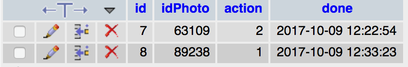
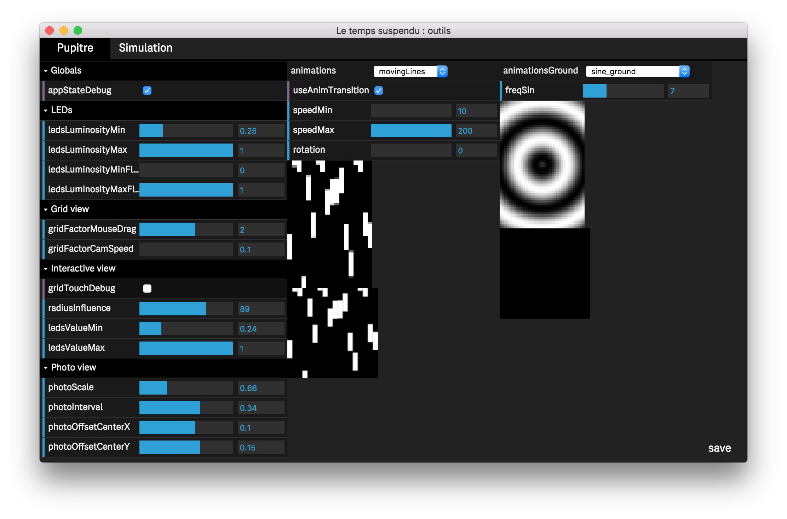
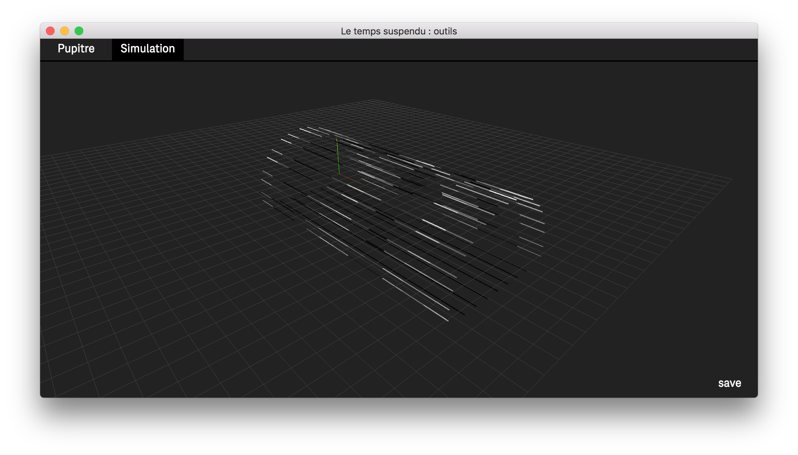

# le-temps-suspendu

* [setup](#setup)
    - [DMX](#dmx)
    - [OSX basic installation](#osx-basic-installation)
    - [OSX terminal, node etc](#osx-terminal-node-etc)
      * [:point_right: install XCode](#point_right-install-xcode)
      * [:point_right: install Homebrew](#point_right-install-homebrew)
      * [:point_right: install NodeJS](#point_right--install-nodejs)
        + [w/ `wget`](#w-wget)
        + [manually](#manually)
      * [:point_right: download & install Electron](#point_right-download--install-electron)
* [project installation](#project-installation)
* [project usage](#project-usage)
* [application configuration](#application-configuration)
* [la fenêtre outil](#la-fenêtre-outil)
---

## setup

#### DMX
[:art: DMX setup guide](https://github.com/chevalvert/OSX-setup-guide-for-exhibitions/blob/master/DMX-macOS-setup-guide.md)

#### OSX basic installation
[:art: OSX setup guide for exhibitions](https://github.com/chevalvert/OSX-setup-guide-for-exhibitions)

#### OSX terminal, node, etc
##### :point_right: install XCode

```sh
xcode-select --install
```

##### :point_right: install Homebrew
```sh
/usr/bin/ruby -e "$(curl -fsSL https://raw.githubusercontent.com/Homebrew/install/master/install)"
```

##### :point_right:  install NodeJS
###### w/ `wget`
```sh
brew install wget
curl "https://nodejs.org/dist/latest/node-${VERSION:-$(wget -qO- https://nodejs.org/dist/latest/ | sed -nE 's|.*>node-(.*)\.pkg</a>.*|\1|p')}.pkg" > "$HOME/Downloads/node-latest.pkg" && sudo installer -store -pkg "$HOME/Downloads/node-latest.pkg" -target "/"
```

`node -v` should output the installed node version

###### manually 
Alternatively, you can manually donwload and install node from https://nodejs.org/en/download/</sup>

##### :point_right: download & install Electron
Download the last stable release for `darwin` from https://github.com/electron/electron/releases. 

Place the `Electron.app` in your `/Applications` folder

<sup>the file should be something like `electron-v1.7.3-darwin-x64.zip`</sup>


## project installation
```sh
git clone https://github.com/chevalvert/le-temps-suspendu.git
cd le-temps-suspendu
npm install
```

## project usage
Either open `Electron.app` and drag & drop the `le-temps-suspendu` in it, or :
```sh
/Applications/Electron.app/Contents/MacOS/Electron path/To/le-temps-suspendu
```

## application configuration
Le fichier `Data/Configs/configuration.json` permet de configurer certaines propriétés de l'application au démarrage, et en particulier des trois fenêtres principales : pupitre, photo et outil («tool»)

- `production` : permet de démarrer l'application en mode production ou non. En mode production, les fenêtres «pupitre» et «photo» sont ouvertes en plein écran sur les écrans 1 et 2 (respectivement). La photo «tool» est masquée. Ce mode outrepasse les valeurs de position et de dimension des photos qui sont réglables dans les paramètres correspondants.

- `stats` : permet d'activer ou non les statistiques de navigation des utilisateurs du pupitre avec la propriété `enable`. Cette activation permet de sauvegarder les sélections de photos qui ont été vues par clicks ou par sélection de code depuis l'interface.
    - `idPhoto` : correspond à l'identifiant de l'item dans la table `export_final` de la base de données.
    - `action` : 1 correspond à un code entré, 2 à un click.
    - `done` : date à laquelle l'action a été effectuée.



- `consoleLog` : permet d'activer le log dans les fenêtres «devTools». Désactivé par défaut dans le mode «production».

- `db_rq` : données connexion à la base de données mysql (ne pas éditer). 
	- `special_codes ` : permet d'ajouter une liste de codes spéciaux à cinq caractères pour retrouver des photos remarquables sur la structure (les Dark Vador, Tchoupi :), PM, etc... ) 

- `artnet` : 
	- `host` : adresse des LEDs (ne pas éditer)
	- `syncAnimRAF` : expérimental, laisser la valeur à false.

- `tool` : 
	- `devtools` : valeur false en mode production. Permet d'activiter d'afficher les outils développeurs dans la fenêtre. 
	- `x`, `y`, `w`, `h` : position et dimension de la fenêtre lorsque le mode «production» est désactivé.
	- `tool3D` : permet d'activer ou non une vue pour tester les animations LEDs avec un modèle 3D de la voute.

- `pupitre` : 
	- `devtools` : valeur false en mode production. Permet d'activiter d'afficher les outils développeurs dans la fenêtre. 
	- `x`, `y`, `w`, `h` : position et dimension de la fenêtre lorsque le mode «production» est désactivé.
	- `bot` : permet de passer le pupitre en mode «bot», la grille de photos défile de manière autonome sur une série de `delayChange` exprimée en seconde(s). Ce mode est principalement un «stress test» qui a été utilisée pendant la phase de développement de l'application pour voir sa tenue en termes de performance et de gestion de la mémoire graphique. 
	- `gridview` : 
		- `useImagesLowRes` : lors d'un déplacement rapide sur la grille de photos, l'application utilise des versions basses résolution des images avant d'affiner la qualité lorsque la navigation se stabilise sur un endroit. Si cette propriété est désactivée, la navigation laisse apparaître la structure graphique qui sous-tend cette grille. 
		- `camera` : permet de positionner la camera au démarrage de l'application en coordonnées normalisées. {x : 0.5, y : 0.5} correspond au centre de la grille. 
		- `keyboard` : `transition` positionné à `true` permet de déclencher une animation sur les touches du clavier lorsque l'utilisateur appuie sur celles-ci.
		- `menu` : idem, mais ne fonctionne pas bien actuellement (laissé sa valeur à `false`)

- `photo` : 
	- `devtools` : valeur false en mode production. Permet d'activiter d'afficher les outils développeurs dans la fenêtre. 
	- `x`, `y`, `w`, `h` : position et dimension de la fenêtre lorsque le mode «production» est désactivé.
	- `flip` : paramètre le nombre de photos utilisées pour l'effet de «flip» sur la fenêtre. 
	- `animations` : ne pas éditer cette partie, configuration de la taille des buffers de rendu pour des animations qui pilotent les LEDs. 


## La fenêtre «outil»
Cette fenêtre est accessible lorsque l'application n'est pas en mode production. Elle permet d'éditer en direct certaines propriétés. Elle est composée de deux onglets Pupitre et Simulation 



### Onglet pupitre 
Cet onglet est composé de trois colonnes. La première colonne permet d'ajuster les paramètres de l'application, tandis que la deuxième et troisième colonne correspondent respectivement aux paramètres des animations LEDs du plafond et du sol.

#### Globals
`appStateDebug` : affiche ou non des informations sur la fenêtre pupitre. À désactiver en mode production. 

#### LEDs
Cette interface permet de régler des propriétés de luminosité minmimum et maximum des LEDs sur le plafond et le sol indépendamment.

- `ledsLuminosityMin` : valeur minimale d'intensité lumineuse des LEDs du plafond lorsqu'aucune animation n'est affichée (0 = éteinte, 1 = pleine intensité)
- `ledsLuminosityMax` : valeur maximale de l'intensité lumineuse des LEDs du plafond.
- `ledsLuminosityMinFloor` : valeur minimale d'intensité lumineuse des LEDs du sol lorsqu'aucune animation n'est affichée.
- `ledsLuminosityMaxFloor` : valeur maximale de l'intensité lumineuse des LEDs du sol. 

#### Gridview
Cette interface permet de régler des propriétés d'ergonomie de navigation sur la grille de photos sur le pupitre.

- `gridFactorMouseDrag` : valeur en pixels à partir duquel le «drag» se déclenche (distance à partir de l'évènement mouseDown / touchDown).
- `gridFactorCamSpeed` : valeur qui paramètre la fluidité du scroll lorsque l'utilisateur navigue sur la grille. 

#### Interactive view
Cette interface permet de régler des propriétés de la vue TOUCHER.

- `gridTouchDebug` : affiche des informations sur la vue TOUCHER. 
- `radiusInfluence` : obsolète.
- `ledsValueMin` : niveau de gris de la représentation des LEDs sur la vue TOUCHER (0 = noir, 1 = blanc) quand les LEDs sont éteintes.
- `ledsValueMax` : niveau de gris de la représentation des LEDs sur la vue TOUCHER (0 = noir, 1 = blanc) quand les LEDs sont allumées.

#### Photo view
Cette interface permet de régler des propriétés d'affichage sur la fenêtre photo.

 - `photoScale` : mise à l'échelle des photos affichées.
 - `photoInterval` : en secondes, temps pour passer d'une photo à l'autre lorsque l'utilsateur navigue sur la grille (via la grille de photos ou la vue TOUCHER). Cette valeur peut-être modulée par la vitesse de déplacement sur la grille de photos.
 - `photoOffsetCenterX`, `photoOffsetCenterY` : position du centre de la photo sur la fenêtre en coordonnées normalisées.

La deuxième colonne correspond aux animations qui animent le plafond. 
La troisième colonne correspond aux animations qui animent le sol. 
La propriété `useAnimTransition` permet d'enchaîner avec un cross-fading les animations, elle s'applique globalement au sol et au plafond. Les animations qui participent aux différents modes de fonctionnement (veille, navigation sur la grille, toucher) sont définies en «dur» dans le fichier `Data/Js/indexPupitre.js`
Chacune des animations possèdent des propriétés propres, qui sont sauvegardées dans le dossier 'Data/Configs' avec le nom 'animation_[id].json'


### Onglet simulation
L'affichage est activée si la propriété `tool.tool3D.enable` est positionné à true. Cette vue est pratique pour développer des animations et apprécier celles-ci dans une vue 3D de la structure des LEDs.



Toutes les propriétés des différents interfaces sont sauvegardés avec le bouton `save`, les fichiers sont au format JSON et se trouvent dans le dossier `Data/Configs` de l'application.


